# 🔄 JJB Travel Bali - Workflow Diagrams

## 🎯 AFFILIATE REGISTRATION WORKFLOW

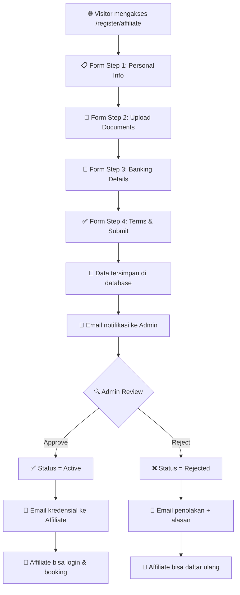

## 📋 BOOKING CREATION WORKFLOW

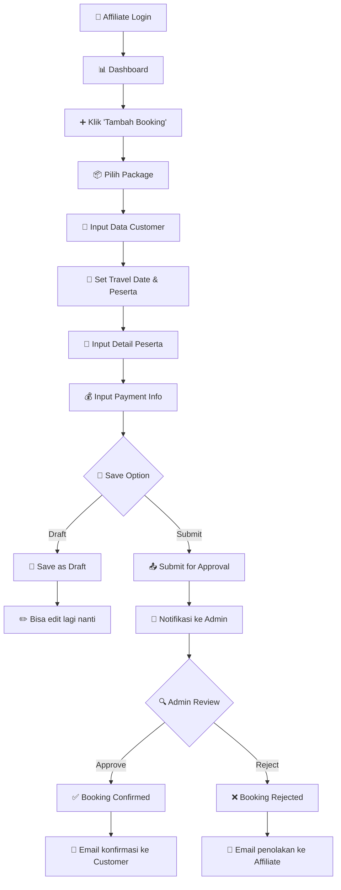

## 💰 COMMISSION & PAYOUT WORKFLOW

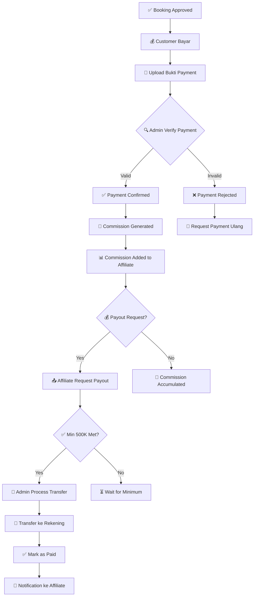

## 🛡️ ADMIN APPROVAL WORKFLOW

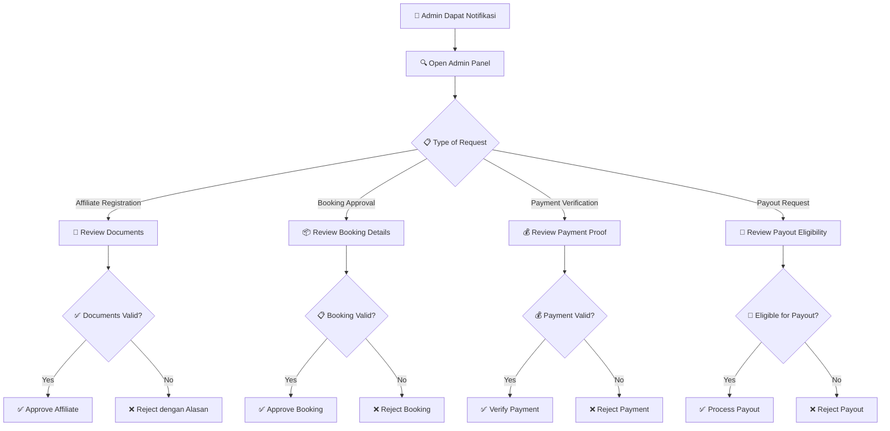

---

## 🎯 USER ROLE PERMISSIONS

### 👤 AFFILIATE PERMISSIONS

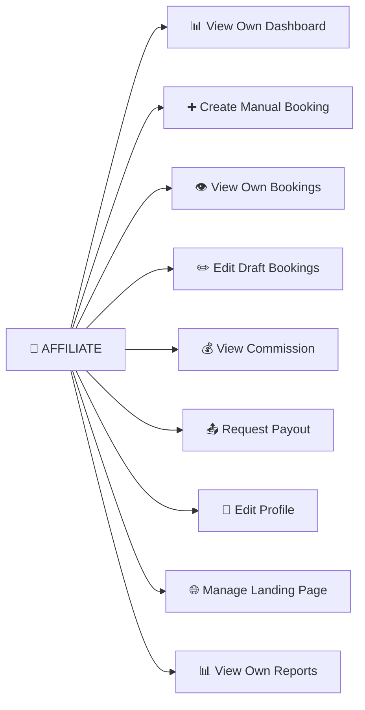

### 🔧 ADMIN PERMISSIONS

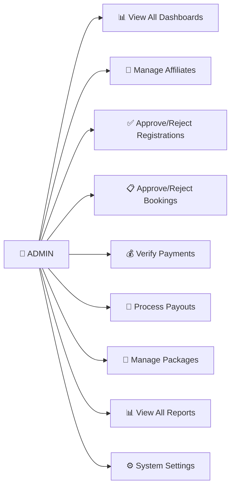

### 👑 SUPER ADMIN PERMISSIONS

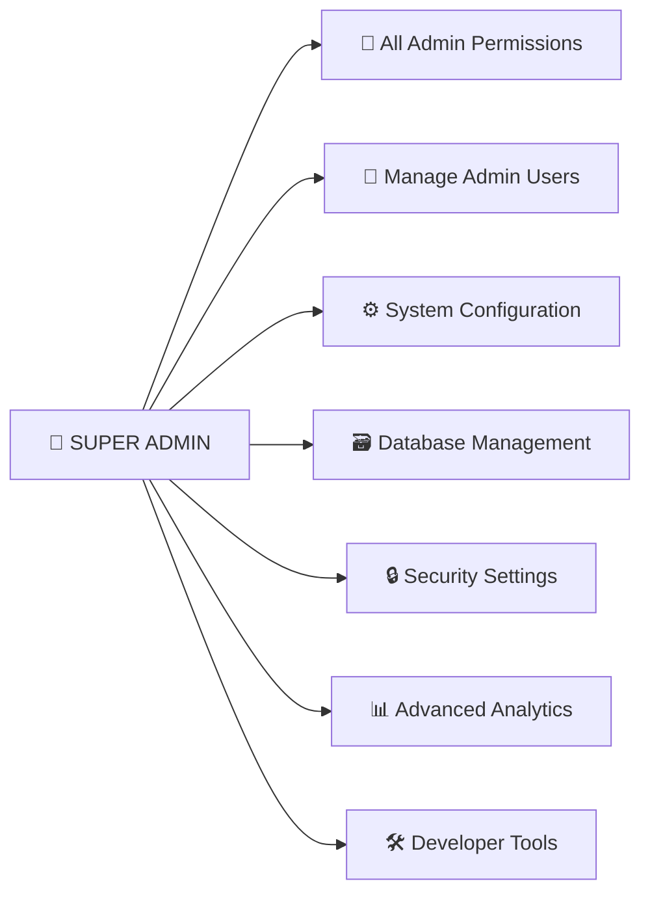

---

## 📊 DATA FLOW ARCHITECTURE

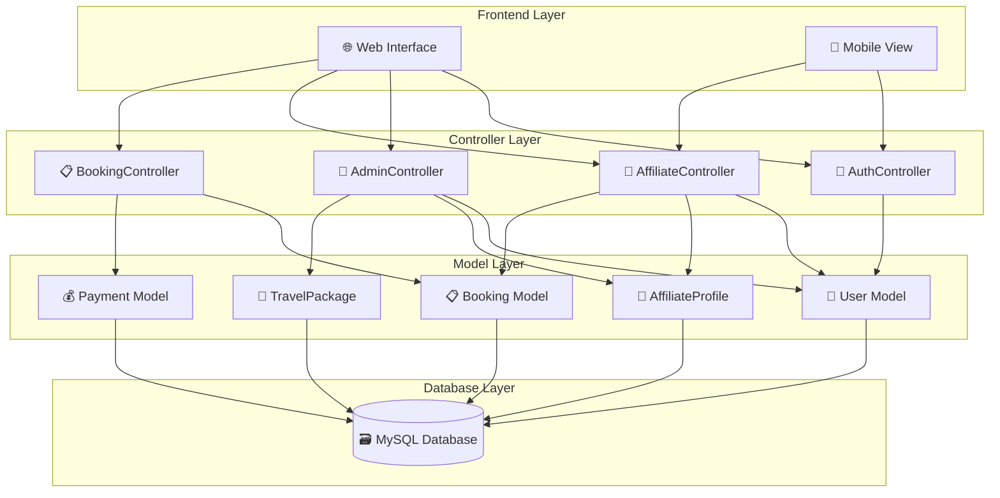

---

## 🔄 SYSTEM INTEGRATION FLOW

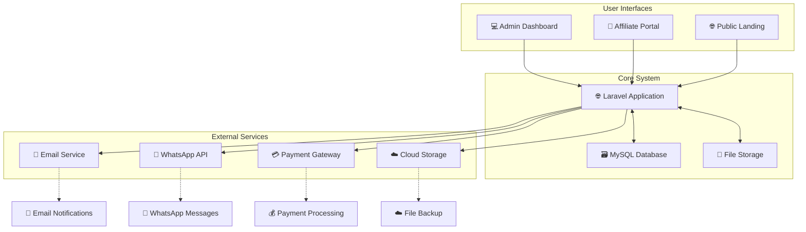

---

## 📱 RESPONSIVE DESIGN WORKFLOW

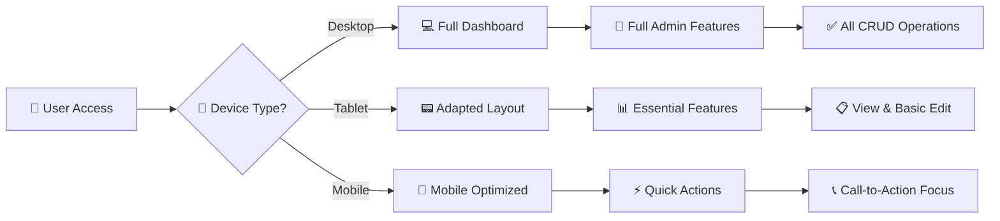

---

## 🛡️ SECURITY WORKFLOW

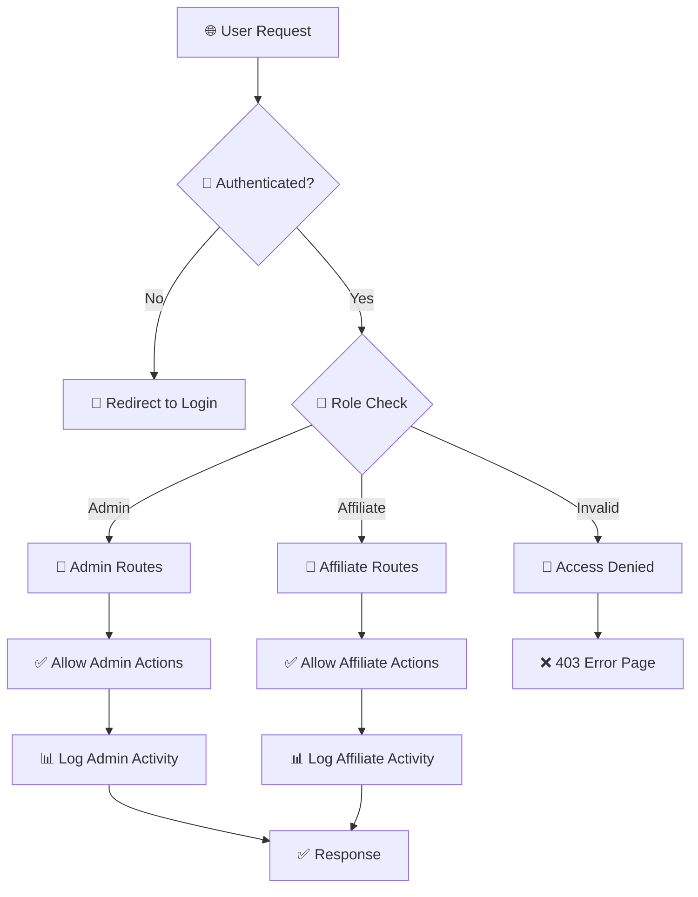

---

## 📈 PERFORMANCE MONITORING FLOW

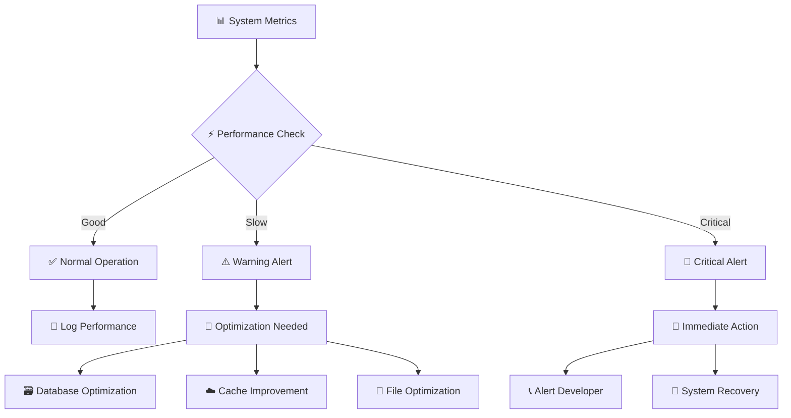

---

**📅 Last Updated**: November 9, 2025  
**🎯 Purpose**: Visual workflow documentation untuk development & user training
